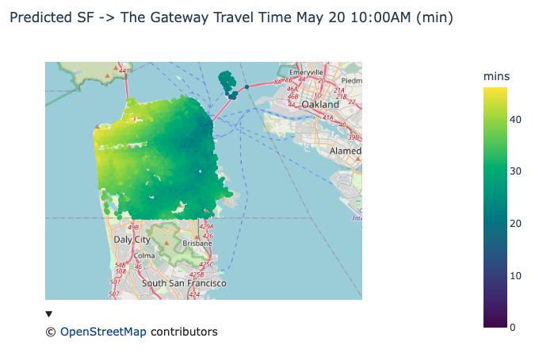

# Distance Map Generator

## Overview

Recently, I wanted to get a visualization of the commute times from all neighborhoods in SF to the newly built Gateway Hall in San Francisco.

Initially, I wanted `o3` to create a diagram from scratch from scratch which would do what I wanted. Unfortunately, this data isn't granularly accessible for an arbitrary destination point.

So, I wanted to spend the least amount of time to generate the visualization here as possible, so I could quickly grok which neighborhoods are the best to live in based on commute times.

## Prerequisites

1. [uv](https://docs.astral.sh/uv/)
2. Sign up for a Google Developers Console Account.

## Setup

1. Add the `GOOGLE_MAPS_API_KEY` to your `.env`.
2. Start the Jupyter Notebook server with `uv run --with jupyter jupyter lab`.
3. Run the notebook.

### Starting Jupyter Notebook in Cursor / VSCode

```bash
# Create a new virtual environment
uv venv

# Activate the virtual environment
source .venv/bin/activate

# Sync the dependencies
uv sync

# Open Notebook -> Select Kernel -> Use newly created venv
```

## Example Output



## Notes

- Google Maps Distance Matrix API is pricey! Each "entry" is ~$0.005 ($5/1K requests), and SF has [~10^3 - ~10^4 street intersections](https://chatgpt.com/share/68253965-0ef8-800f-b7b7-730c97ee97c8), which means each run is $50 🤯.
   - Always store expensive API results.
- There are competitive distance matrix APIs, such as [distancematrix.ai](https://distancematrix.ai/pricing).
